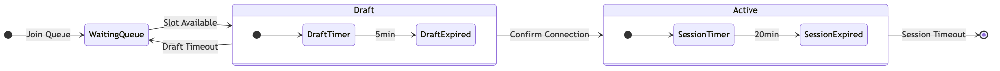
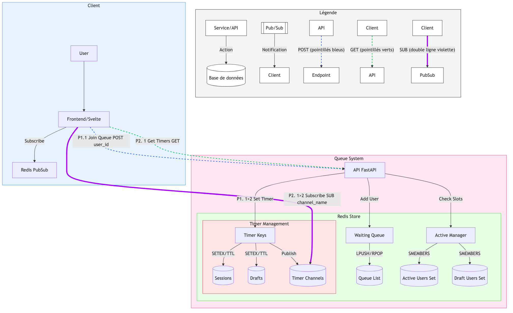

# Introduction
Ce projet implémente un système de gestion de file d'attente intelligent pour contrôler l'accès à Lucie, notre modèle de langage (LLM) entraîné from scratch. Face à l'intérêt croissant pour les modèles de langage open source et la nécessité de gérer efficacement les ressources de calcul, ce système permet d'offrir une expérience utilisateur optimale tout en maintenant la stabilité du service.

### Le Contexte
Lucie est déployée via une interface basée sur open web-ui, permettant au public de tester et d'interagir avec le modèle. Cependant, pour garantir des performances optimales et une expérience utilisateur de qualité, nous devons limiter le nombre d'accès simultanés tout en assurant une distribution équitable du temps d'utilisation.

### Pourquoi un système de file d'attente ?
- **Gestion des ressources** : Optimise l'utilisation des ressources GPU/CPU nécessaires pour faire fonctionner le modèle
- **Équité d'accès** : Assure une distribution équitable du temps d'accès entre les utilisateurs
- **Expérience utilisateur** : Offre une visibilité claire sur le temps d'attente et la disponibilité
- **Stabilité** : Évite la surcharge du système en contrôlant le nombre d'utilisateurs simultanés

### Les Caractéristiques 
- Gestion de 50 sessions utilisateurs simultanées
- Sessions limitées à 20 minutes pour maximiser le nombre d'utilisateurs servis
- Système de "draft" de 5 minutes permettant une transition fluide entre les utilisateurs
- Mécanisme de file d'attente transparent avec notifications en temps réel
- Intégration seamless avec l'interface open web-ui

### Dernier build -TEST- :

<details>
<summary>Cliquez pour déplier/replier</summary>

#### TEST RESULT

1. **Mode test-only **
```
{output}
```
Votre contenu ici (laissez une ligne vide après le summary)
- Point 1
- Point 2
- Point 3

</details>

## Table des matières
- 1. [Introduction](#introduction)
-   - [1.1. Le Contexte](#le-contexte)  
-   - [1.2. Pourquoi un système de file d'attente ?](#pourquoi-un-système-de-file-dattente)
-   - [1.3. Les Caractéristiques](#les-caractéristiques)
- 2. [Fonctionnalités](#fonctionnalités)
- 3. [Architecture](#architecture)
-   - [3.1. Prérequis](#prérequis)
-   - [3.2. Installation](#installation)
-   - [3.3. Configuration](#configuration)
- 4. [Installation](#installation)
- 5. [Configuration](#configuration)
- 6. [Utilisation](#utilisation)
- 7. [Scripts CLI](#scripts-cli)
- 8. [Tests](#tests)
- 9. [Structure du Projet](#structure-du-projet)
- 10. [API Reference](#api-reference)
- 11. [Glossaire](#glossaire)

## Fonctionnalités
- 🔄 File d'attente en temps réel
- 👥 Gestion de 50 utilisateurs simultanés
- ⏲️ Sessions de 20 minutes
- 🎟️ Système de réservation temporaire (draft)
- 📊 Métriques en temps réel
- 🔔 Notifications via Redis Pub/Sub

# Architecture
- **FastAPI** : APIrest et Websocket
- **Redis** : Cache et pub/sub
- **Celery** : Gestion des tâches asynchrones
- **Docker** : Service management

### Prérequis
- Python 3.12+
- Docker et Docker Compose
- Poetry
<details>
<!-- REPORT TITLE -->
<summary>🧪 Rapport de Tests - 2025-01-08 03:28:42 - 32/32 PASSED</summary>

<!-- START_TEST_REPORT -->

### 🧪 Rapport de Tests - 2025-01-08 03:28:42 - 32/32 PASSED

<div class="test-report">
    <style>
        .test-report {
            background-color: #1e1e1e;
            color: #ffffff;
            padding: 16px;
            border-radius: 8px;
            font-family: 'Courier New', Courier, monospace;
            white-space: pre-wrap;
        }
        .test-report .green { color: #4CAF50; }
        .test-report .red { color: #f44336; }
        .test-report .yellow { color: #ffeb3b; }
        .test-report .blue { color: #2196F3; }
        .test-report .bold { font-weight: bold; }
        .test-report .underline { text-decoration: underline; }
    </style>
    <span class="bold">============================= test session starts ==============================</span>
platform linux -- Python 3.13.1, pytest-7.4.4, pluggy-1.5.0 -- /usr/local/bin/python3.13
cachedir: .pytest_cache
rootdir: /app
configfile: pyproject.toml
testpaths: tests
plugins: timeout-2.3.1, asyncio-0.21.2, anyio-3.7.1, cov-4.1.0
asyncio: mode=Mode.AUTO
<span class="bold">collecting ... </span>collected 32 items
tests/test_api_endpoints.py::TestAPI::test_join_queue_flow <span class="green"><span class="green">PASSED</span></span><span class="green">        [  3%]</span>
tests/test_api_endpoints.py::TestAPI::test_join_queue_flow_when_full <span class="green"><span class="green">PASSED</span></span><span class="green"> [  6%]</span>
tests/test_api_endpoints.py::TestAPI::test_leave_queue <span class="green"><span class="green">PASSED</span></span><span class="green">            [  9%]</span>
tests/test_api_endpoints.py::TestAPI::test_get_status_nonexistent <span class="green"><span class="green">PASSED</span></span><span class="green"> [ 12%]</span>
tests/test_api_endpoints.py::TestAPI::test_heartbeat <span class="green"><span class="green">PASSED</span></span><span class="green">              [ 15%]</span>
tests/test_api_endpoints.py::TestAPI::test_heartbeat_invalid <span class="green"><span class="green">PASSED</span></span><span class="green">      [ 18%]</span>
tests/test_celery.py::test_celery_eager_mode <span class="green"><span class="green">PASSED</span></span><span class="green">                      [ 21%]</span>
tests/test_celery.py::test_celery_task_chaining <span class="green"><span class="green">PASSED</span></span><span class="green">                   [ 25%]</span>
tests/test_celery.py::test_celery_error_handling <span class="green"><span class="green">PASSED</span></span><span class="green">                  [ 28%]</span>
tests/test_integration.py::TestIntegration::test_concurrent_users <span class="green"><span class="green">PASSED</span></span><span class="green"> [ 31%]</span>
tests/test_integration.py::TestIntegration::test_requeue_mechanism <span class="green"><span class="green">PASSED</span></span><span class="green"> [ 34%]</span>
tests/test_queue_manager.py::TestQueueManager::test_add_to_queue <span class="green"><span class="green">PASSED</span></span><span class="green">  [ 37%]</span>
tests/test_queue_manager.py::TestQueueManager::test_draft_flow <span class="green"><span class="green">PASSED</span></span><span class="green">    [ 40%]</span>
tests/test_queue_manager.py::TestQueueManager::test_draft_expiration <span class="green"><span class="green">PASSED</span></span><span class="green"> [ 43%]</span>
tests/test_queue_manager.py::TestQueueManager::test_error_handling <span class="green"><span class="green">PASSED</span></span><span class="green"> [ 46%]</span>
tests/test_queue_manager.py::TestQueueManager::test_timer_edge_cases <span class="green"><span class="green">PASSED</span></span><span class="green"> [ 50%]</span>
tests/test_queue_manager.py::TestQueueManager::test_slot_checker_lifecycle <span class="green"><span class="green">PASSED</span></span><span class="green"> [ 53%]</span>
tests/test_queue_manager.py::TestQueueManager::test_verify_queue_state_errors <span class="green"><span class="green">PASSED</span></span><span class="green"> [ 56%]</span>
tests/test_queue_manager.py::TestQueueManager::test_session_management <span class="green"><span class="green">PASSED</span></span><span class="green"> [ 59%]</span>
tests/test_timers.py::TestTimers::test_draft_timer_redis <span class="green"><span class="green">PASSED</span></span><span class="green">          [ 62%]</span>
tests/test_timers.py::TestTimers::test_session_timer_redis <span class="green"><span class="green">PASSED</span></span><span class="green">        [ 65%]</span>
tests/test_timers.py::TestTimers::test_get_timers_endpoint_draft <span class="green"><span class="green">PASSED</span></span><span class="green">  [ 68%]</span>
tests/test_timers.py::TestTimers::test_get_timers_endpoint_session <span class="green"><span class="green">PASSED</span></span><span class="green"> [ 71%]</span>
tests/test_timers.py::TestTimers::test_get_timers_endpoint_both <span class="green"><span class="green">PASSED</span></span><span class="green">   [ 75%]</span>
tests/test_timers.py::TestTimers::test_get_timers_endpoint_no_timers <span class="green"><span class="green">PASSED</span></span><span class="green"> [ 78%]</span>
tests/test_timers.py::TestTimers::test_pubsub_connection_draft <span class="green"><span class="green">PASSED</span></span><span class="green">    [ 81%]</span>
tests/test_timers.py::TestTimers::test_pubsub_connection_session <span class="green"><span class="green">PASSED</span></span><span class="green">  [ 84%]</span>
tests/test_timers.py::TestTimers::test_pubsub_multiple_updates <span class="green"><span class="green">PASSED</span></span><span class="green">    [ 87%]</span>
tests/test_timers.py::test_update_timer_channel <span class="green"><span class="green">PASSED</span></span><span class="green">                   [ 90%]</span>
tests/test_timers.py::test_update_timer_channel_expiration <span class="green"><span class="green">PASSED</span></span><span class="yellow">        [ 93%]</span>
tests/test_timers_async.py::TestTimersAsync::test_pubsub_multiple_updates_async <span class="green"><span class="green">PASSED</span></span><span class="yellow"> [ 96%]</span>
tests/test_timers_async.py::TestTimersAsync::test_update_timer_channel_async <span class="green"><span class="green">PASSED</span></span><span class="yellow"> [100%]</span>
<span class="yellow">=============================== <span class="yellow">warnings summary</span> ===============================</span>
tests/test_timers.py::test_update_timer_channel
  /Users/chrysostomebeltran/Documents/GitHub/redis_queue/tests/test_timers.py:409: AlwaysEagerIgnored: task_always_eager has no effect on send_task
tests/test_timers.py::test_update_timer_channel
  /Users/chrysostomebeltran/Documents/GitHub/redis_queue/tests/test_timers.py:441: DeprecationWarning: Call to deprecated close. (Use aclose() instead) -- Deprecated since version 5.0.1.
tests/test_timers.py::test_update_timer_channel_expiration
  /Users/chrysostomebeltran/Documents/GitHub/redis_queue/tests/test_timers.py:464: AlwaysEagerIgnored: task_always_eager has no effect on send_task
tests/test_timers.py::test_update_timer_channel_expiration
  /Users/chrysostomebeltran/Documents/GitHub/redis_queue/tests/test_timers.py:499: DeprecationWarning: Call to deprecated close. (Use aclose() instead) -- Deprecated since version 5.0.1.
-- Docs: https://docs.pytest.org/en/stable/how-to/capture-warnings.html
---------- coverage: platform linux, python 3.13.1-final-0 -----------
Name                   Stmts   Miss  Cover   Missing
----------------------------------------------------
app/celery_app.py          6      6     0%   1-19
app/main.py               61     12    80%   19-35, 48, 56, 64, 86-87
app/queue_manager.py     304     87    71%   40-52, 87-88, 110-112, 114-116, 137-139, 165-166, 186, 190, 201-208, 228, 232-234, 238-246, 267, 277-283, 307, 318-320, 351-356, 397-400, 430-433, 454-481, 486-505, 529-530, 551-553
----------------------------------------------------
TOTAL                    371    105    72%
<span class="yellow">======================= <span class="green">32 passed</span>, <span class="yellow"><span class="bold">4 warnings</span><span class="yellow"> in 35.06s</span><span class="yellow"> ========================</span>

</div>

<!-- END_TEST_REPORT -->


</details>


<details>
<summary><h3>📊 Schémas de la file d'attente</h3></summary>

<div align="left" style="margin-left: 20px; border-left: 2px solid #3eaf7c; padding: 10px;">



</div>
</details>

<details>
<summary><h3>🏗️ Schémas de l'Architecture</h3></summary>

<div align="left" style="margin-left: 20px; border-left: 2px solid #3eaf7c; padding: 10px;">



</div>
</details>
<details>
<summary> <h2 id="installation"> Installation</h2></summary>

<div style="margin-left: 20px; padding: 10px; border-left: 2px solid #3eaf7c;">


### Installation avec Poetry

#### Installation des dépendances
```bash
poetry install
```
#### Activation de l'environnement virtuel
```bash
poetry shell
```

###  Docker compose
#### Lancement de tous les services
```bash
docker-compose up -d
```
#### Arrêt des services
```bash
docker-compose down
```
</div>
</details>

<details>
<summary> <h2 id="configuration"> Configuration</h2></summary>

<div style="margin-left: 20px; padding: 10px; border-left: 2px solid #3eaf7c;">

### Variables d'environnement

#### Redis Configuration
```Yaml
REDIS_HOST=redis
REDIS_PORT=6379
REDIS_DB=0
```

### Application Configuration
```yaml
MAX_ACTIVE_USERS=50
SESSION_DURATION=1200 # 20 minutes
DRAFT_DURATION=300 # 5 minutes
```

</div>
</details>

# Utilisation

<details>
<summary> <h2 id="modedev"> Démarrage en mode dev</h2></summary>

<div style="margin-left: 20px; padding: 10px; border-left: 2px solid #3eaf7c;">


### Lancement auto reload pour traquer les changements
```bash
poetry run dev run --reload
```

### Lancement sur un port spécifique
```bash
poetry run dev run --port 8080
```

### Démarrage en production

## Avec Docker Compose
```bash
docker-compose up -d
```
## Vérification des logs
```bash
docker-compose logs -f
```

</div>
</details>

<details>
<summary> <h2 id="scriptscli">Scripts CLI</h2></summary>

<div style="margin-left: 20px; padding: 10px; border-left: 2px solid #3eaf7c;">

### Script de développement (`poetry run dev`)

#### Lancer l'application
```bash
dev run [--host] [--port] [--reload]
```
#### Gérer Docker
```bash
dev docker-up # Démarre les services
```
```bash
dev docker-down # Stop services
```
```bash
dev docker-logs # Affiche les logs
```

### Script de test (`poetry run test`)
#### Lancer les tests
```bash
test run [--cov] [--html] [test_path]
```
#### Tests dans Docker
```bash
test docker [--logs] [--test-only]
```

#### Mise à jour de la documentation des tests
```bash
# Exécuter les tests et mettre à jour le README
test update-doc [test_path]

# Mettre à jour le README avec le dernier rapport sans relancer les tests
test update-doc --insert
```

#### Options de test
| Option | Description |
|--------|-------------|
| `--logs` | Affiche les logs détaillés des tests |
| `--test-only` | Affiche uniquement les résultats des tests (sans logs Docker) |
| `--cov` | Active la couverture de code |
| `--html` | Génère un rapport HTML de couverture |
| `--insert` | Met à jour le README avec le dernier rapport sans relancer les tests |

### Script de formatage (`poetry run format`)
#### option de formatage
| option | description |
|--------|-------------|
| format black [--check] | Formatage avec black |
| format isort | Tri des imports |
| format lint | Vérification avec flake8 |
| format all | Exécute tous les formatages |


</div>
</details>


### Script de test de charge (`poetry run load-test`)
#### Test utilisateur unique
```bash
load-test single USER_ID
```
#### Test de groupe
```bash
load-test group --size 50
```
#### Test de charge progressif
```bash
load-test load --users 200 --batch-size 20 --delay 5
```


## Tests

### Types de tests
- **Tests unitaires** : Teste les composants individuellement
- **Tests d'intégration** : Vérifie l'interaction entre les composants
- **Tests API** : Valide les endpoints HTTP
- **Tests de charge** : Évalue les performances sous charge

### Exécution des tests
#### Tous les tests
```bash
poetry run test run
```
#### Avec couverture
```bash
poetry run test run --cov --html
```
#### Tests dans Docker
```bash
poetry run test docker
```


## API Reference

### Endpoints REST FastAPI
| Endpoint | Méthode | Description |
|----------|---------|-------------|
| `/queue/join/{user_id}` | POST | Rejoindre la file d'attente |
| `/queue/confirm/{user_id}` | POST | Confirmer la connexion |
| `/queue/leave/{user_id}` | POST | Quitter la file |
| `/queue/status/{user_id}` | GET | Obtenir le statut |
| `/queue/metrics` | GET | Obtenir les métriques |


### États utilisateur
- **Waiting** : En attente dans la file (position > 0)
- **Draft** : Slot disponible et temporairement réservé (5 minutes pour confirmer)
- **Connected** : Session active (20 minutes)
- **Disconnected** : Déconnecté du système

### Transitions d'états
1. `Waiting → Draft` : Quand un slot devient disponible
2. `Draft → Connected` : Après confirmation dans les 5 minutes
3. `Draft → Waiting` : Si pas de confirmation dans les 5 minutes (retour en file)
4. `Connected → Disconnected` : Après 20 minutes ou déconnexion manuelle

### Notifications Redis
| Canal | Description | Exemple de message |
|-------|-------------|-------------------|
| `queue_status:{user_id}` | En attente | ```{"status": "waiting", "position": 5}``` |
| `queue_status:{user_id}` | Slot disponible | ```{"status": "draft", "duration": 300}``` |
| `queue_status:{user_id}` | Connexion confirmée | ```{"status": "connected", "session_duration": 1200}``` |
| `queue_status:{user_id}` | Session expirée | ```{"status": "disconnected", "reason": "session_timeout"}``` |
| `queue_status:{user_id}` | Draft expiré | ```{"status": "waiting", "reason": "draft_timeout", "position": 5}``` |

### Exemples de scénarios de notification

1. **Utilisateur rejoint la file**
```json
{
    "user_id": "user123",
    "status": "waiting",
    "position": 5,
    "estimated_wait": 600
}
```

2. **Slot devient disponible**
```json
{
    "user_id": "user123",
    "status": "slot_available",
    "duration": 300,
    "expires_at": "2024-01-20T15:30:00Z"
}
```

3. **Connexion confirmée**
```json
{
    "user_id": "user123",
    "status": "connected",
    "session_duration": 1200,
    "expires_at": "2024-01-20T16:00:00Z"
}
```

4. **Notification d'expiration imminente**
```json
{
    "user_id": "user123",
    "status": "expiring_soon",
    "remaining_time": 60,
    "session_type": "active"
}
```

5. **Notification de déconnexion**
```json
{
    "user_id": "user123",
    "status": "disconnected",
    "reason": "session_timeout",
    "requeue_position": 3
}
```

## Notions

### On dit les termes :
- **Slot** -> Place disponible pour un utilisateur actif dans le système
- **Draft** -> Période de réservation temporaire (5 minutes) pendant laquelle un utilisateur peut confirmer sa connexion
- **Session** -> Durée de connexion active (20 minutes) pendant laquelle un utilisateur peut utiliser le système
- **File d'attente** -> Liste ordonnée des utilisateurs en attente d'un slot
- **Pub/Sub** -> Système de publication/souscription de Redis permettant la communication en temps réel, c'est mieux que le websocket quand la communication est unidirectionnel (notification)

## Installation avec Make

Le projet utilise un Makefile pour automatiser l'installation et la configuration de l'environnement de développement.

### Commandes Make disponibles

| Commande | Description |
|----------|-------------|
| `make setup` | Installation complète (pyenv, Python 3.12, Poetry, dépendances) |
| `make install-pyenv` | Installation de pyenv |
| `make install-python` | Installation de Python 3.12.1 via pyenv |
| `make install-poetry` | Installation de Poetry |
| `make install-deps` | Installation des dépendances du projet |
| `make dev` | Démarrage du serveur de développement |
| `make test` | Exécution des tests |
| `make docker-up` | Démarrage des services Docker |
| `make docker-down` | Arrêt des services Docker |
| `make clean` | Nettoyage des fichiers temporaires et caches |

### Installation initiale

1. **Installation complète automatique** :
```bash
make setup
source ~/.bashrc  
```

2. **Installation étape par étape** :
```bash
# Installation de pyenv
make install-pyenv
source ~/.bashrc 

# Installation de Python 3.12
make install-python

# Installation de Poetry
make install-poetry

# Installation des dépendances
make install-deps
```

### Développement

```bash
# Démarrer le serveur de développement
make dev

# Lancer les tests
make test

# Démarrer les services Docker
make docker-up

# Arrêter les services Docker
make docker-down
```

### Nettoyage

```bash
# Nettoyer les fichiers temporaires et caches
make clean
```

Pour voir toutes les commandes disponibles :
```bash
make help
```

